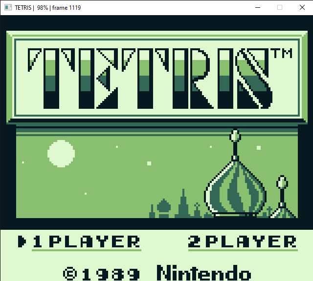

# RGB

### Rusty GameBoy

A gameboy emulator written in rust. Currently can only run Tetris and Dr. Mario.

## Build

`cargo build --release`

## Run

`cargo run -r <ROM_FILE>`

## Missing features

- Audio
- Proper rendering
- Debugger
- Remapping controls + controller support
- Save states